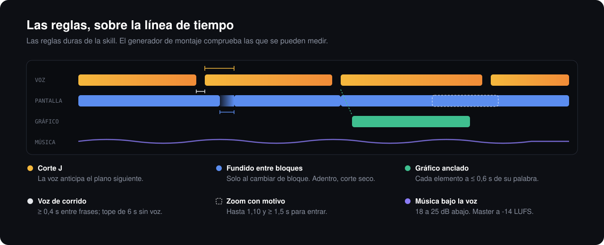

<p align="center">
  
</p>

<p align="center">
  <a href="LICENSE"></a>
  <a href="skills/edicion-de-video/biblioteca/LICENCIAS.md"></a>
  <a href="https://agentskills.io/specification"></a>
  <a href="https://github.com/heygen-com/hyperframes"></a>
  
</p>

<p align="center">
  <a href="#instalar">Instalar</a> ·
  <a href="#qué-hace">Qué hace</a> ·
  <a href="#las-reglas">Las reglas</a> ·
  <a href="#biblioteca-de-audio">Biblioteca de audio</a> ·
  <a href="#estructura">Estructura</a> ·
  <a href="#contribuir">Contribuir</a>
</p>

---

Un agente de IA ya puede grabar la pantalla, generar una voz y armar un video. Lo que le falta es criterio de
editor: cuándo cortar, cuánto silencio aguanta una frase, cuándo un gráfico ayuda y cuándo estorba, a qué
volumen va la música. Sin eso, el video sale con la pantalla saltando, modales que se abren y cierran solos,
gráficos que quedan vacíos cinco segundos y siglas mal leídas.

**agent-video-editor** es una skill que le da ese criterio, con números y fuentes, y plantillas que **fallan si
el montaje rompe una regla**. Nació armando tutoriales de software narrados, pero el criterio sirve para
cualquier video explicativo, Short o Reel.

Funciona con cualquier agente que lea skills en formato [`SKILL.md`](https://agentskills.io/specification):
Claude Code, Codex, Cursor, Gemini CLI y otros.

## Instalar

**Con [`skills`](https://github.com/vercel-labs/skills)**, para cualquier agente compatible:

```bash
npx skills add kmilo93sd/agent-video-editor
```

**Como plugin de Claude Code:**

```text
/plugin marketplace add kmilo93sd/agent-video-editor
/plugin install agent-video-editor@agent-video-editor
```

**A mano:** copia `skills/edicion-de-video/` en la carpeta de skills de tu agente (en Claude Code,
`~/.claude/skills/`).

Después pídele al agente cosas como:

> Revisa el ritmo de este tutorial: entre frase y frase quedan silencios largos mientras se llena el formulario.

> Busca un whoosh suave y una cama de música tranquila para la intro, y dime a qué volumen van bajo la voz.

> La voz lee «ACHS» como una palabra. Arréglalo y verifica que ahora se diga bien.

## Qué hace

| | |
|---|---|
| **Proceso de punta a punta** | Brief, guion, grabación, voz, montaje, revisión, render y publicación, con qué archivo leer en cada paso. |
| **Ritmo con fuentes** | Cada cuánto cambiar la pantalla, plano mínimo, silencios y transiciones, por tipo de video. Cada número dice de dónde sale: documentación oficial, estudio, creador o experiencia propia. |
| **Voz que suena bien** | Guion sin frases hechas, siglas escritas como se pronuncian, una pasada por capítulo con alineación y verificación con whisper. |
| **Gráficos que no estorban** | Anclados a la palabra que los nombra, nunca vacíos, con tiempo de lectura calculado. |
| **Audio con niveles** | Voz, música, ducking y efectos en dB y LUFS, y master para YouTube. |
| **Publicación** | Miniatura, título, descripción y capítulos según la especificación de YouTube. |
| **Revisión antes de mostrar** | Una checklist que mezcla comprobaciones automáticas y lo que solo se ve a ojo o se oye con audífonos. |

## Las reglas

<p align="center">
  
</p>

Son las reglas duras de la skill. El generador de montaje de `plantillas/` **se cae** si el clip retrocede,
si vuelve a un clip ya dejado, si una frase cae en un segundo que ya pasó o si quedan más de 6 s sin voz:

1. **La pantalla manda y la voz se acomoda.** El clip nunca retrocede ni repite un segundo; si la frase dura
   más que la acción, se congela el resultado.
2. **Velocidad honesta.** 1× en navegación, clics y resultados; tipeo como máximo a 1,5×. Lo que sobra se corta.
3. **Planos de 5 s o más**, y nunca un corte en mitad de una animación de la app.
4. **Un gráfico nunca está vacío.** Entra 0,5 s antes de su palabra como máximo, tiene contenido antes del
   primer segundo y cada elemento aparece a 0,6 s o menos de cuando la voz lo nombra.
5. **Zoom solo al dato que nombra la voz.** Hasta 1,10, con 1,5 s o más para entrar y uno cada dos frases.
6. **Siglas y números como se dicen**, verificados con whisper.
7. **Sin frases hechas**, y siempre con datos ficticios.
8. **Solo audio con licencia clara** (CC0, la Audio Library de YouTube o licencia escrita de uso comercial).

## Biblioteca de audio

30 archivos **CC0 1.0**, sin atribución obligatoria y aptos para videos monetizados. Cada uno trae su duración,
su sonoridad en LUFS y para qué sirve.

| Categoría | Archivos | Ejemplos |
|---|---:|---|
| Transición | 6 | whoosh suave, barrido largo, deslizar |
| Clic | 4 | clic de mouse, tap, toggle |
| Aparición | 4 | aparece, desaparece, pop |
| Notificación | 3 | notificación, pregunta |
| Tipeo | 3 | tecla, tipeo de 3 s, scroll |
| Impacto | 3 | golpe seco, impacto suave |
| Éxito y error | 4 | éxito, error |
| Música | 3 | ambiente, lofi, loop calmo |

```bash
node skills/edicion-de-video/biblioteca/buscar.mjs whoosh
node skills/edicion-de-video/biblioteca/buscar.mjs --categoria musica --rutas
```

El origen de cada archivo (Kenney, OpenGameArt o generado aquí), con su página y el texto de la licencia, está
en [`LICENCIAS.md`](skills/edicion-de-video/biblioteca/LICENCIAS.md).

## Estructura

```text
skills/edicion-de-video/
├── SKILL.md                    punto de entrada: proceso, reglas duras e índice
├── checklist-de-revision.md    lo que se revisa antes de mostrar un corte
├── referencias/                ritmo, gancho, voz, gráficos, audio, miniatura, tutoriales,
│                               licencias e integración con HyperFrames
├── plantillas/                 grabar, voz, verificación, ilustraciones, montaje y hoja de contacto
├── biblioteca/                 sonidos CC0, catálogo y buscador
└── evals/                      casos con lo que el agente debería responder
```

La skill sigue la [especificación de Agent Skills](https://agentskills.io/specification) y las
[buenas prácticas de Anthropic](https://platform.claude.com/docs/en/agents-and-tools/agent-skills/best-practices):
la descripción dice qué hace y cuándo usarla, SKILL.md queda bajo 500 líneas, el detalle se carga solo cuando
hace falta, las referencias están a un nivel de profundidad y los archivos largos llevan índice.

### Requisitos de las plantillas

- Node 20 o superior y `ffmpeg` en el PATH.
- Voz: una clave de ElevenLabs y el `voice_id` en un `.env`, que se pasa con `--env`. Las plantillas no buscan
  claves hacia arriba ni las copian.
- Grabación: Playwright. Montaje y render: [HyperFrames](https://github.com/heygen-com/hyperframes) y sus skills.

El criterio editorial no necesita nada de esto: sirve para revisar o planificar un video hecho con cualquier
herramienta.

## Idioma

La skill está escrita en español, y las reglas de voz (siglas deletreadas, grafías fonéticas) son para
narración en español. El criterio de montaje no depende del idioma.

## Contribuir

Las contribuciones son bienvenidas. Antes de abrir un PR, lee [CONTRIBUTING.md](CONTRIBUTING.md) y valida la
skill:

```bash
npx skills-ref validate ./skills/edicion-de-video
```

## Licencia

- Código y textos: [MIT](LICENSE).
- Sonidos de `biblioteca/`: CC0 1.0, con la fuente de cada uno en
  [`LICENCIAS.md`](skills/edicion-de-video/biblioteca/LICENCIAS.md).
