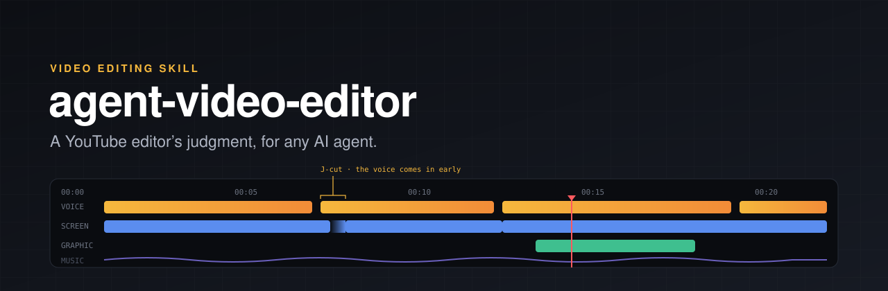
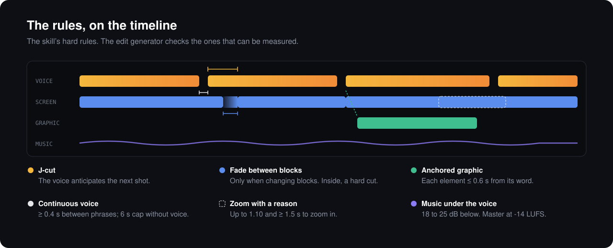

<p align="center">
  
</p>

<p align="center">
  <a href="LICENSE"></a>
  <a href="skills/editing-videos/library/LICENSES.md"></a>
  <a href="skills/editing-videos/graphics/LICENSES.md"></a>
  <a href="https://agentskills.io/specification"></a>
  <a href="https://github.com/heygen-com/hyperframes"></a>
  
</p>

<p align="center">
  <a href="#install">Install</a> ·
  <a href="#what-it-does">What it does</a> ·
  <a href="#the-rules">The rules</a> ·
  <a href="#audio-library">Audio library</a> ·
  <a href="#graphics-kit-and-meme-reference">Graphics and memes</a> ·
  <a href="#structure">Structure</a> ·
  <a href="#contributing">Contributing</a>
</p>

---

An AI agent can already cut footage, run ffmpeg, generate a voice and assemble a timeline. What it lacks is
an editor's judgment: when to cut, how much silence a phrase can take, when a graphic helps and when it gets
in the way, how loud the music should be. Without that, a vlog drags through every shot that was filmed, a
talking head keeps every "um", a Short spends its first three seconds on a logo, and a tutorial's graphics sit
empty while the voice talks about something else.

**agent-video-editor** is a skill that gives it that judgment, with numbers and sources: pacing per video
type, hooks, J and L cuts, captions, audio levels, color, thumbnails and licensing. It adds a recipe per type
of video (talking head, vlog, podcast, Shorts from long form, narrated screen tutorial), a CC0 library of
sounds and music, a CC0 kit of animated graphics, a meme reference with its Content ID risk, and tested
templates that **fail if the edit breaks a rule**.

It works with any agent that reads skills in the [`SKILL.md`](https://agentskills.io/specification) format
(Claude Code, Codex, Cursor, Gemini CLI and others) and with any editor: Premiere Pro, DaVinci Resolve, Final
Cut Pro, CapCut, ffmpeg, Remotion or HyperFrames.

## Install

**With [`skills`](https://github.com/vercel-labs/skills)**, for any compatible agent:

```bash
npx skills add kmilo93sd/agent-video-editor
```

**As a Claude Code plugin:**

```text
/plugin marketplace add kmilo93sd/agent-video-editor
/plugin install agent-video-editor@agent-video-editor
```

**By hand:** copy `skills/editing-videos/` into your agent's skills folder (in Claude Code,
`~/.claude/skills/`).

Then ask the agent things like:

> Here is the footage from my weekend trip to Lisbon. Find the story, give me a cold open and an edit list
> for a 10-minute vlog.

> Tighten this talking-head take: remove the filler, soften the jump cuts and tell me where a punch-in helps.

> Cut three Shorts from this podcast episode, with captions that fit 9:16 and a hook in the first second.

> Check the pacing of this software tutorial, then find a soft whoosh and a calm music bed and tell me how
> loud they go under the voice.

## What it does

The skill has two layers and three asset kits. The **core** is editing craft that holds for any video and
any tool; the **recipes** add what changes for one type of video, and the agent loads only the one it needs.
The **sound library**, the **graphics kit** and the **meme reference** are searched from the command line and
copied into the project.

| Core | |
|---|---|
| **Pacing with sources** | What a cut is for, shot length, J and L cuts, jump cuts, b-roll and transitions, with a pacing table for talking heads, vlogs, explainers, screen tutorials, podcasts and Shorts. Every number says where it comes from: official documentation, study, creator practice or our own experience. |
| **Hook and retention** | The first 30 s as YouTube measures them, a hook per video type, chapters, end screens. |
| **Graphics, text and captions** | Graphics anchored to the word that names them and never empty, reading time for text, caption timing and layout, zoom and punch-in, safe zones. |
| **Audio with levels** | Dialogue cleanup, room tone, music under the voice and ducking, sound effects, and masters for YouTube and podcast feeds, in LUFS and dB. |
| **Basic color** | Exposure, white balance and matching shots, LUTs as a starting point, SDR and HDR delivery. |
| **Publishing and licensing** | Thumbnail, title, description and chapters to YouTube's specification; which music, sound effects and footage are safe for a monetized channel. |
| **Any tool** | How to apply it in Premiere Pro, DaVinci Resolve, Final Cut Pro or CapCut (edit decision lists, markers, caption files, instructions with numbers), in ffmpeg, in Remotion or in HyperFrames. |
| **Review before showing** | A checklist of what is measured, what is seen and what is heard before a cut is shown. |

| Recipes | |
|---|---|
| **Talking head** | Removing filler, softening jump cuts, punch-ins, b-roll on what is said. |
| **Vlog** | Finding the story in the footage, cold open, wind and location audio, matching cameras. |
| **Podcast to YouTube** | Multicam sync, cutting between angles, open mics, a separate podcast master, chapters per topic. |
| **Shorts from long form** | Picking the moment, reframing to 9:16, burned-in captions, loops. |
| **Narrated screen tutorial** | The pipeline the skill was born from: Playwright recording, a synthetic ElevenLabs voice and a HyperFrames edit generator that **fails if the edit breaks a rule**, with tested templates. |

| Assets | |
|---|---|
| **Sound library** | 128 CC0 sounds and music tracks, measured in LUFS, with a search tool that computes how loud each one goes under your voice. |
| **Graphics kit** | 26 CC0 animated graphics for HyperFrames: arrows, highlights, callouts, lower third, progress, chapter cards, end screen and more. |
| **Meme reference** | 59 memes and meme formats: what they mean, when they fit, how to recreate them without the original, and their Content ID risk. No media. |

## The rules

<p align="center">
  
</p>

The core's hard rules, for any video:

1. **Every cut has a reason**: it removes dead time, changes the information or follows an action.
2. **Deliver the promise early**: what the title and thumbnail promise shows up in the first seconds.
3. **The voice never fights anything**: music 18–25 dB under it and ducked, room tone under every gap.
4. **Master once, to the destination**: -14 LUFS and -1 dBTP for YouTube, -16 LKFS for a podcast feed.
5. **A graphic is never empty.** It enters at most 0.5 s before its word, has content within the first
   second, and each element appears 0.6 s or less from when the voice names it.
6. **Text stays long enough to read**, and captions follow subtitle timing (42 characters per line, 2
   lines, 20 frames minimum).
7. **Zoom and punch-in only when motivated**, and never across a cut.
8. **Shots match** in exposure, white balance and level.
9. **Only media with a clear license** (CC0, the YouTube Audio Library, or a written commercial-use
   license).
10. **No invented numbers**, and nothing rendered or published without approval.

Each recipe adds its own. The narrated screen tutorial, for example, adds that the screen leads and the
voice adapts, that speed is 1× except typing at 1.5× at most, shots of 5 s or more, zooms of up to 1.10, and
fake demo data only; its generator fails if the clip goes back, returns to a clip it already left, or leaves
more than 6 s without voice.

## Audio library

128 **CC0 1.0** files, with no attribution required and fit for monetized videos: 113 sound effects (mono WAV,
48 kHz, -22 LUFS) and 15 music tracks (stereo MP3, 48 kHz, -16 LUFS). Each one comes with its duration, its
loudness and true peak, and what it is for.

| Category | Files | Examples |
|---|---:|---|
| Transition | 18 | soft whoosh, page turn, risers, reverse cymbal, downlifter, glitch |
| Click | 12 | mouse click, tap, toggle, hover, select |
| Appear | 12 | pop, modal open and close, panel expand, drag and drop |
| Notification | 11 | notification, question, bell, alert, beeps, countdown |
| Success | 7 | success, chime, check mark |
| Error | 5 | soft errors, buzz |
| Typing | 9 | key press, keyboard typing (1 to 6 s), scroll |
| Impact | 5 | soft impact, dry thud, light wood |
| Stinger | 14 | win jingles, fanfare, intro and outro, serious, energetic |
| Office | 17 | coins, cash register, paper, pencil, book, stamp, calculator, clock |
| Ambience | 3 | room tone, office air conditioning, busy office (loops) |
| Music | 15 | ambient and emotional piano, lofi, acoustic, funky house, orchestral, tension |

```bash
node skills/editing-videos/library/search.mjs whoosh
node skills/editing-videos/library/search.mjs --category music --paths
node skills/editing-videos/library/search.mjs pop --voice -17
```

With `--voice`, the tool prints each sound's volume for a voice at that level: effects 15 dB under it, music
20 dB and ambience 30 dB. The origin of each file (Kenney, OpenGameArt or generated here, with the script that
makes them), with its page and the license text, is in
[`LICENSES.md`](skills/editing-videos/library/LICENSES.md).

## Graphics kit and meme reference

**Graphics kit.** 26 CC0 graphics for HyperFrames: arrows, hand-drawn circles and highlight rings, underlines
and scribbles, a spotlight, a cursor click ripple, callouts and tooltips, a lower third, keyboard-key chips, a
step counter, a progress bar, a countdown, a checkmark and a cross, a before/after split, chapter cards, an
end-screen layout, light-leak and grain overlays, and a generic like-and-subscribe prompt. Each one is an HTML
snippet with its timing, colors in CSS custom properties and a function that adds seekable tweens to the
composition's timeline. Open [`preview.html`](skills/editing-videos/graphics/preview.html) to see them all
animate.

```bash
node skills/editing-videos/graphics/search.mjs --category arrows
node skills/editing-videos/graphics/search.mjs chapter --paths
```

**Meme reference.** 59 memes and meme formats that work in tutorials and explainers, with what each one means,
when it fits, how long it stays on screen, how to recreate it with the graphics kit, who owns the original
and how likely it is to trigger Content ID. It ships no meme media on purpose: recreate the joke or license
the original. See [`memes/README.md`](skills/editing-videos/memes/README.md).

```bash
node skills/editing-videos/memes/search.mjs fail --risk low
```

## Structure

```text
skills/editing-videos/
├── SKILL.md                    entry point: process, core rules, pick your recipe, index
├── review-checklist.md         the universal review before showing a cut
├── references/                 the core: pacing and cuts, hook and retention, graphics and captions,
│                               audio, color, thumbnail and title, licenses, tools
├── recipes/                    one file per video type, loaded only when needed
│   ├── talking-head.md
│   ├── vlog.md
│   ├── podcast-to-youtube.md
│   ├── shorts-from-long-form.md
│   ├── narrated-screen-tutorial.md
│   └── narrated-screen-tutorial/
│       ├── voice.md            synthetic voice and script
│       ├── hyperframes-generator.md
│       └── templates/          recording, voice, verification, illustrations, edit and contact sheet
├── library/                    CC0 sounds and music: catalog, search, verify, licenses
│   ├── sfx/
│   ├── music/
│   └── tools/synthesize.py     reproduces the sounds generated for the library
├── graphics/                   CC0 HyperFrames graphics: catalog, search, preview, check, licenses
├── memes/                      meme reference (no media): catalog, search, README
└── evals/                      cases with what the agent should answer
```

The skill follows the [Agent Skills specification](https://agentskills.io/specification) and
[Anthropic's best practices](https://platform.claude.com/docs/en/agents-and-tools/agent-skills/best-practices):
the description says what it does and when to use it, SKILL.md stays under 500 lines, detail is loaded only
when needed, references are one level deep, and long files have a table of contents.

### Template requirements

The core and the general recipes need nothing: they work for planning, editing or reviewing a video made
with any tool. Only the narrated screen tutorial templates need:

- Node 20 or later and `ffmpeg` on the PATH.
- Voice: an ElevenLabs key and the `voice_id` in a `.env`, passed with `--env`. The templates do not search
  upwards for keys or copy them.
- Recording: Playwright. Editing and rendering: [HyperFrames](https://github.com/heygen-com/hyperframes) and
  its skills.

The search tools of the sound library, the graphics kit and the meme reference need Node. Rebuilding the
library's synthesized sounds with `library/tools/synthesize.py` needs Python with numpy, and `ffmpeg`.

## Language

The skill is written in English, and its editing guidance does not depend on the language of the video.
The voice recipe of the narrated screen tutorial
([`voice.md`](skills/editing-videos/recipes/narrated-screen-tutorial/voice.md)) covers Spanish narration:
its rules for spelled-out acronyms and phonetic spellings, and their examples, are in Spanish.

## Contributing

Contributions are welcome. Before opening a PR, read [CONTRIBUTING.md](CONTRIBUTING.md) and validate the
skill:

```bash
npx skills-ref validate ./skills/editing-videos
```

## License

- Code and text: [MIT](LICENSE).
- Sounds in `library/`: CC0 1.0, with each one's source in
  [`LICENSES.md`](skills/editing-videos/library/LICENSES.md).
- Graphics in `graphics/`: CC0 1.0, see [`LICENSES.md`](skills/editing-videos/graphics/LICENSES.md).
- The meme reference ships no meme media; the originals belong to their owners.
